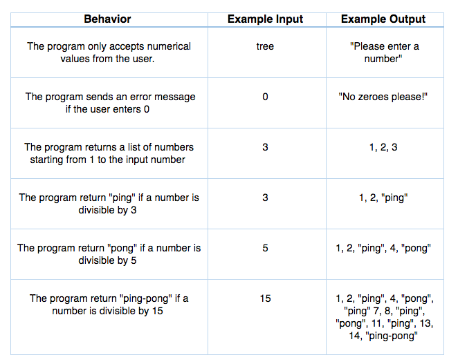

# Ping Pong Game

#### A game that returns "ping" or "pong" depending on user input.

#### By _**Aimen Khakwani**_

## Description

This simple game returns a list of numbers up to the user input number, aside from those that are divisible by 3, 5, or 15. Play Ping Pong here: https://aimenkhakwani.github.io/ping-pong/

## Setup/Installation Requirements

* Download from GitHub onto your local drive

## Support and contact details

Please contact me through GitHub

## Technologies Used

_**HTML, CSS, Bootstrap, JavaScript, jQuery**_

### License

*MIT*

Copyright (c) 2016 **_Aimen Khakwani_**
